# Materials Project Analysis

This project involves the analysis of nanomaterials using data from The Materials Project API. It includes scripts for elasticity and piezoelectric property calculations, as well as structure visualisations.

## Scripts

1. `elasticity.py`: Calculates and analyses elasticity properties of materials.
2. `piezo.py`: Calculates and analyzes piezoelectric properties of materials.
3. `plot_structure.py`: Visualises crystal structures and related properties.
4. `PbTiO3-phase-diagram.py`: Generates a phase diagram for PbTiO3 as an example.

## Data

- `elasticity-data.csv` and `elasticity-data.json`: Processed dataset files for elasticity properties.
- `piezo-data.csv` and `piezo-data.json`: Processed dataset files for piezoelectric properties.

## Plot Structures and Images

### Elasticity Analysis

The elasticity analysis provides insights into the mechanical properties of various materials.

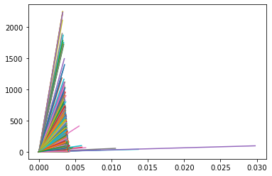

This plot shows the stress-strain relationships for all the materials in the dataset, these calculations help us understand their elastic behavior under various loads better.

### Crystal Structures

We've analyzed several crystal structures as part of this project:

#### Aluminum Arsenide (AlAs)

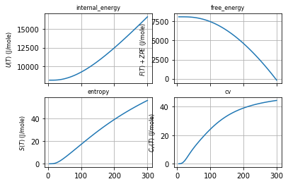

AlAs has a zinc blende crystal structure, which is common for III-V semiconductors.

#### Magnesium Diboride (MgB2)

MgB2 is a superconductor with a hexagonal crystal structure.

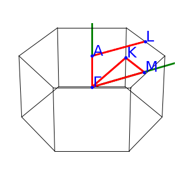
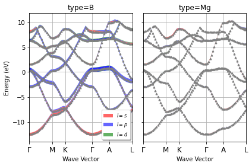
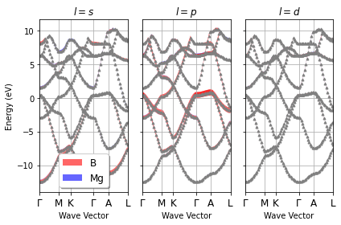
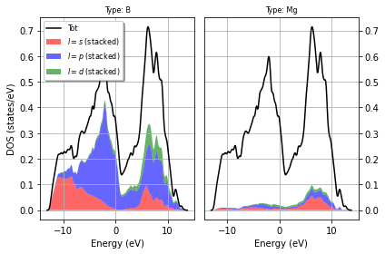
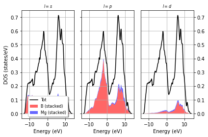
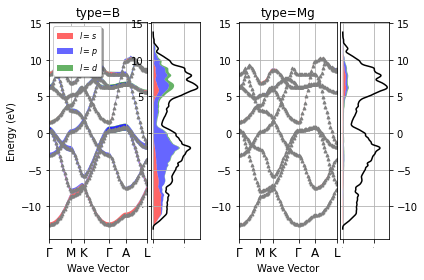
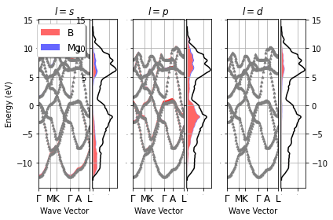

These images show various aspects of the MgB2 structure, including different crystallographic orientations and electronic properties.

#### Silicon (Si)

Silicon has a diamond cubic crystal structure.

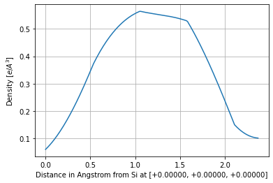
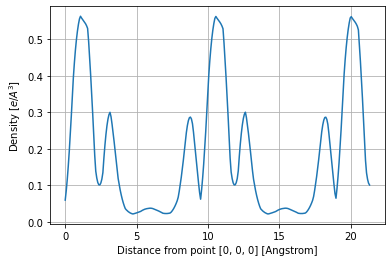
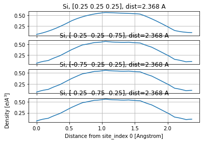

These images illustrate different properties of the Si crystal structure, including electronic band structure and density of states.

#### Silicon Oxide (Si3O6)

Si3O6 is a form of silicon oxide with a complex crystal structure.

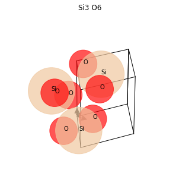
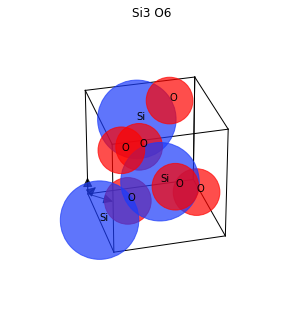

These images show various aspects of the Si3O6 structure, including its unit cell and electronic properties.

#### Silicon Dioxide (SiO2)

SiO2, commonly known as silica, has several crystalline forms.

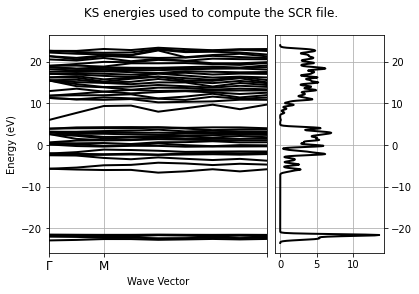
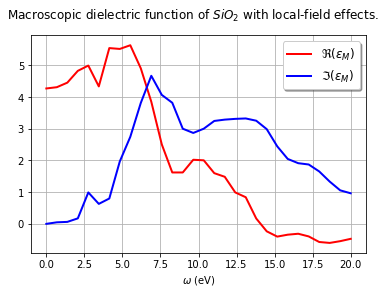
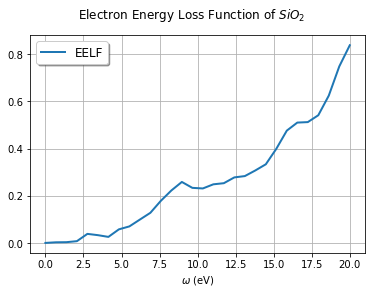

These images illustrate different properties of SiO2, including its crystal structure and electronic characteristics.

## Usage

To use this project:

1. Clone the repository using `git clone https://github.com/guyanik/materials-project-data.git`
2. Install the required dependencies using `pip install -r requirements.txt`
3. Run the desired Python scripts

## Research Contribution

This project was part of a research collaboration at Space Alloy from December 2020 to January 2022. Key contributions include:

- Retrieving raw datasets using The Materials Project API
- Running simulations of nanomaterials using VASP for analysis of material properties
- Implementing SARIMAX for climate change forecasts to support research motivation

## License

This project is licensed under the MIT License - see the [LICENSE](LICENSE) file for details.

## Authors

H. Görkem Uyanık

For any questions or feedback, please open an issue in this repository.
